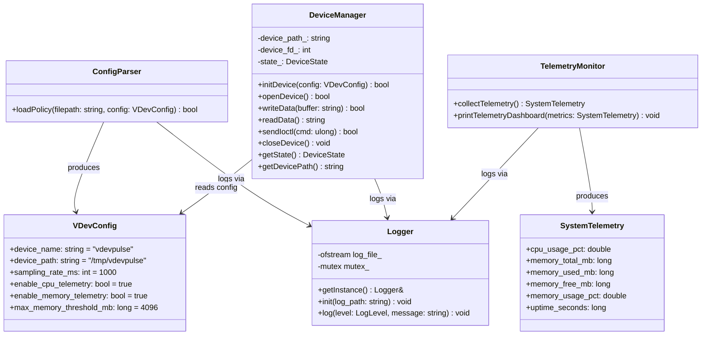
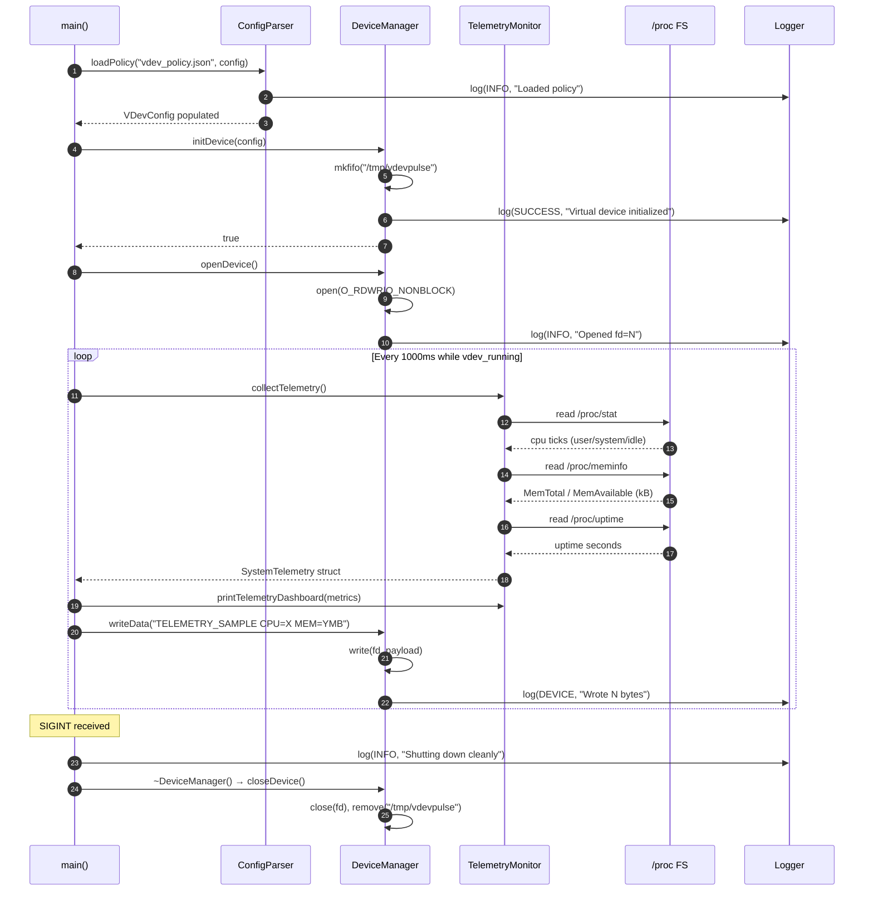

# Stage 3: System Design & Architecture

## 3.1 Overall System Architecture

VDevPulse is structured as a modular, single-process daemon with four loosely-coupled subsystems communicating through well-defined C++ interfaces.

```
╔═══════════════════════════════════════════════════════════════════╗
║                   vdevpulse — System Daemon                       ║
║                                                                   ║
║  ┌─────────────────┐        ┌───────────────────────────────┐    ║
║  │  ConfigParser   │        │       Logger (Singleton)       │    ║
║  │  vdev_policy.   │        │  INFO | SUCCESS | WARNING      │    ║
║  │      json       │        │  ERROR | DEVICE                │    ║
║  └────────┬────────┘        └──────────────┬────────────────┘    ║
║           │ VDevConfig                      │ std::mutex RAII     ║
║           ▼                                 ▼                     ║
║  ┌────────────────────────────────────────────────────────────┐   ║
║  │                      DeviceManager                         │   ║
║  │   mkfifo() → open(O_RDWR|O_NONBLOCK) → write() → read()  │   ║
║  │   IOCTL: VDEV_START(0x8001) | STOP(0x8002) | RESET(0x8003)│   ║
║  │   State: STOPPED ─→ RUNNING ─→ PAUSED                     │   ║
║  └──────────────────────────┬─────────────────────────────────┘   ║
║                             │ reads /proc                         ║
║                             ▼                                     ║
║  ┌────────────────────────────────────────────────────────────┐   ║
║  │                    TelemetryMonitor                        │   ║
║  │   /proc/stat     → CPU tick delta → cpu_usage_pct         │   ║
║  │   /proc/meminfo  → MemTotal/MemAvail → memory_used_mb     │   ║
║  │   /proc/uptime   → uptime_seconds                         │   ║
║  └────────────────────────────────────────────────────────────┘   ║
║                             │ writes to                           ║
║                             ▼                                     ║
║                  /tmp/vdevpulse  (POSIX FIFO)                     ║
║                             │                                     ║
╚═════════════════════════════│═════════════════════════════════════╝
                              │ POSIX read() / write()
                              ▼
                 User-space Applications / Shell
                 (cat /tmp/vdevpulse, echo CMD > /tmp/vdevpulse)
```

---

## 3.2 Major System Components & Responsibilities

| Component | Class / Struct | Responsibility |
| :--- | :--- | :--- |
| **Logger** | `Logger` (Singleton) | Thread-safe color-coded log output to stdout and file |
| **Policy Engine** | `ConfigParser`, `VDevConfig` | Load runtime settings from `vdev_policy.json` |
| **Telemetry Engine** | `TelemetryMonitor`, `SystemTelemetry` | Parse `/proc` kernel FS; compute CPU%, RAM%, uptime |
| **Device Manager** | `DeviceManager`, `DeviceState` | Create/open/read/write/close FIFO; handle IOCTL state |
| **Daemon Entry Point** | `main()` | CLI dispatch, SIGINT/SIGTERM handling, main loop |

---

## 3.3 Core Data Structures

### 3.3.1 `VDevConfig` — Device Policy Configuration
```cpp
// include/vdevpulse/config.hpp
struct VDevConfig {
    std::string device_name         = "vdevpulse";      // Logical name of the virtual device
    std::string device_path         = "/tmp/vdevpulse"; // FIFO node path on the filesystem
    int         sampling_rate_ms    = 1000;              // Telemetry sampling interval (ms)
    bool        enable_cpu_telemetry    = true;
    bool        enable_memory_telemetry = true;
    long        max_memory_threshold_mb = 4096;          // Alert if RAM usage exceeds this
};
```

### 3.3.2 `SystemTelemetry` — Live Telemetry Snapshot
```cpp
// include/vdevpulse/telemetry_monitor.hpp
struct SystemTelemetry {
    double cpu_usage_pct    = 0.0;  // CPU utilization as percentage
    long   memory_total_mb  = 0;    // Total installed RAM in MB
    long   memory_used_mb   = 0;    // Currently used RAM in MB
    long   memory_free_mb   = 0;    // Currently available RAM in MB
    double memory_usage_pct = 0.0;  // RAM utilization as percentage
    long   uptime_seconds   = 0;    // System uptime from /proc/uptime
};
```

### 3.3.3 `DeviceState` — Virtual Device State Machine
```cpp
// include/vdevpulse/device_manager.hpp
enum class DeviceState {
    STOPPED,   // FIFO node not open; no I/O active
    RUNNING,   // FIFO node open; read/write active
    PAUSED     // Reserved for future hold-without-close semantics
};

// Virtual IOCTL Command Codes
constexpr unsigned long VDEV_IOCTL_START = 0x8001;
constexpr unsigned long VDEV_IOCTL_STOP  = 0x8002;
constexpr unsigned long VDEV_IOCTL_RESET = 0x8003;
```

### 3.3.4 `LogLevel` — Log Severity Enum
```cpp
// include/vdevpulse/logger.hpp
enum class LogLevel {
    INFO,     // General operational messages   (Cyan)
    SUCCESS,  // Successful operations           (Green)
    WARNING,  // Non-critical issues             (Yellow)
    ERROR,    // Critical failures               (Red)
    DEVICE    // Device I/O and IOCTL events     (Magenta)
};
```

---

## 3.4 UML Diagrams

### 3.4.1 Class Diagram



### 3.4.2 Sequence Diagram — Telemetry Sampling & Device Write Cycle



### 3.4.3 State Machine Diagram — Virtual Device Lifecycle

```mermaid
stateDiagram-v2
    [*] --> Uninitialized

    Uninitialized --> Initializing : initDevice(config)
    Initializing --> NodeCreated : mkfifo() succeeds
    Initializing --> Uninitialized : mkfifo() fails (errno logged)

    NodeCreated --> Running : openDevice() O_RDWR|O_NONBLOCK
    Running --> Running : writeData() / readData()
    Running --> Running : sendIoctl(VDEV_IOCTL_START)
    Running --> Stopped : sendIoctl(VDEV_IOCTL_STOP)
    Stopped --> Running : sendIoctl(VDEV_IOCTL_RESET)

    Running --> Cleanup : SIGINT / SIGTERM received
    Stopped --> Cleanup : SIGINT / SIGTERM received
    Cleanup --> [*] : close(fd), fs::remove(node)
```

---

## 3.5 Implementation Plan

| Phase | Files | Description |
| :--- | :--- | :--- |
| Phase 1 | `logger.hpp`, `logger.cpp` | Implement Logger Singleton with mutex, ANSI colors, file output |
| Phase 2 | `config.hpp`, `config.cpp` | Implement JSON string extraction, `VDevConfig` defaults |
| Phase 3 | `telemetry_monitor.hpp`, `telemetry_monitor.cpp` | Implement `/proc` parsers for stat, meminfo, uptime |
| Phase 4 | `device_manager.hpp`, `device_manager.cpp` | Implement FIFO lifecycle, read/write/ioctl, RAII destructor |
| Phase 5 | `main.cpp` | Implement CLI dispatch (`run`/`status`/`write`/`ioctl`) and signal handling |
| Phase 6 | `tests/`, `CMakeLists.txt` | Integrate CTest, write device and telemetry unit tests |

---

## 3.6 Development Environment & Git Strategy

### Toolchain
| Tool | Version | Purpose |
| :--- | :--- | :--- |
| Compiler | GCC 15.2 (WSL2) | C++17 compilation |
| Build System | CMake 3.28 | Build orchestration and CTest |
| Target OS | Ubuntu 24.04 via WSL2 | POSIX runtime environment |
| VCS | Git 2.45 | Version control |
| IDE / Editor | VSCode + WSL Remote | Development |

### Git Branching & Commit Convention
- **Branch**: All development on `main`.
- **Commit Naming**: Stage-prefixed commit messages: `[Stage N] Description`
- **Progress Commits**: One commit per SDLC stage to demonstrate continuous progress to reviewers.

---

## 3.7 Version Control & Progress Evidence

- **SDLC Phase**: Stage 3 — System Design & Architecture
- **Git Commit**: `[Stage 3] System Architecture, UML diagrams & class interfaces`
- **Evidence**: All four `.hpp` header files committed with complete class declarations.

---

## 3.8 Roadmap for Next Stage (Stage 4)

- Implement all `.cpp` source files following the Phase 1–5 implementation plan
- Construct the `main.cpp` CLI dispatcher with `SIGINT`/`SIGTERM` signal handling
- Validate compilation with `cmake .. && make -j4`
- Log and document any issues encountered during integration
