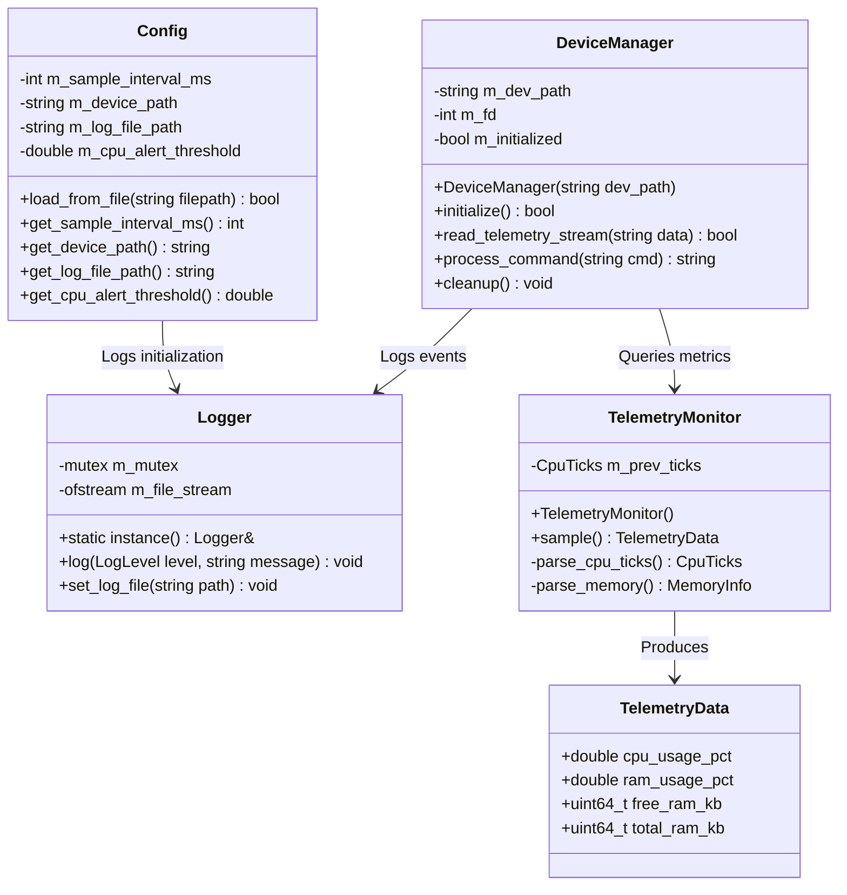
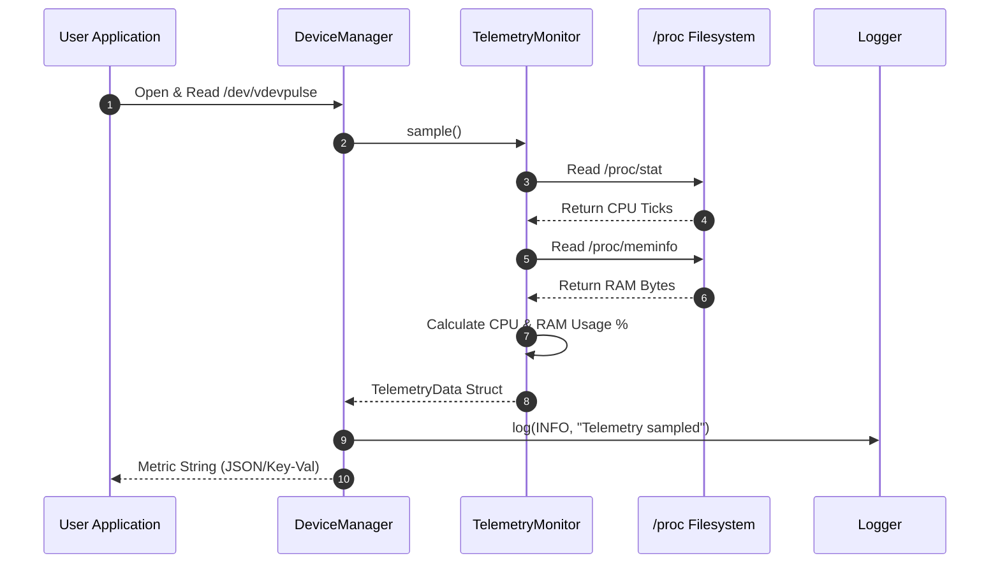
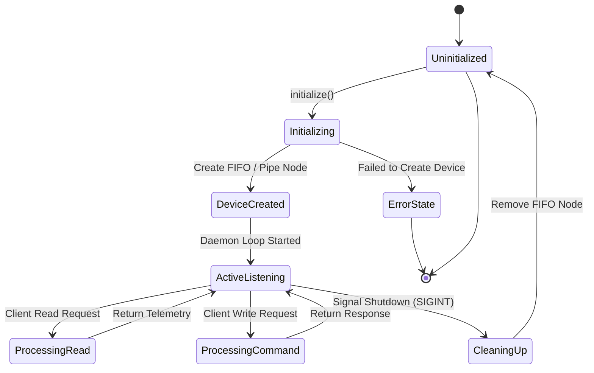

# Stage 3: Architecture & Design Specification

## 1. System Architecture & UML Documentation

### High-Level System Architecture
The VDevPulse system consists of four primary subsystems:
1. **Config Engine (`Config`)**: Parses runtime JSON policies.
2. **Telemetry Monitor (`TelemetryMonitor`)**: Reads `/proc` system files.
3. **Virtual Device Manager (`DeviceManager`)**: Manages non-blocking file descriptor I/O and POSIX commands.
4. **Logger (`Logger`)**: Centralized thread-safe logging interface.

```
+-----------------------------------------------------------------------+
|                           vdevpulse Daemon                            |
|                                                                       |
|  +------------------+     +-------------------+     +--------------+  |
|  |   Config Engine  |     | Telemetry Monitor |     | Thread Logger|  |
|  |  (vdev_policy)   |     | (/proc/stat, mem) |     | (vdev.log)   |  |
|  +--------+---------+     +---------+---------+     +-------+------+  |
|           |                         |                       |         |
|           +-------------------------+-----------------------+         |
|                                     |                                 |
|                         +-----------v-----------+                     |
|                         | Virtual Device Manager|                     |
|                         |    (/tmp/vdevpulse)   |                     |
|                         +-----------+-----------+                     |
+-------------------------------------|---------------------------------+
                                      |
                           POSIX Read / Write Stream
                                      |
                          +-----------v-----------+
                          | User-Space Applications|
                          +-----------------------+
```

### UML Diagrams

#### UML Class Diagram



#### Sequence Diagram (Telemetry Sampling & Device I/O)



#### State Machine Diagram (Virtual Device Lifecycle)



---

## 2. Version Control & Git Commit Tracking

- **SDLC Phase**: Stage 3 - System Architecture & Design
- **Commit Target**: `[Stage 3] System Architecture, UML diagrams & class interfaces`
- **Branch**: `main`
- **Repository Path**: `Wipro Individual Project/vdevpulse/`

---

## 3. Progress Evidence

- Class definitions completed in `include/vdevpulse/` (`logger.hpp`, `config.hpp`, `device_manager.hpp`, `telemetry_monitor.hpp`).
- System interaction flows verified using Sequence and State Machine UML models.
- Header guard specifications and modular separation of interface from implementation achieved.

---

## 4. Demonstration & Presentation Notes

- **Key Takeaway for Mentors**: Walk mentors through the Mermaid Class Diagram, Sequence Diagram, and State Machine Diagram.
- **Demo Focus**: Highlight how `DeviceManager` decouples user-space device requests from low-level `/proc` filesystem reading in `TelemetryMonitor`.

---

## 5. Roadmap for Next Stage (Stage 4)

- Implement core C++ source files (`src/*.cpp`).
- Construct main daemon loop with signal handling (`SIGINT`, `SIGTERM`).
- Configure CMake build pipeline (`CMakeLists.txt`).
