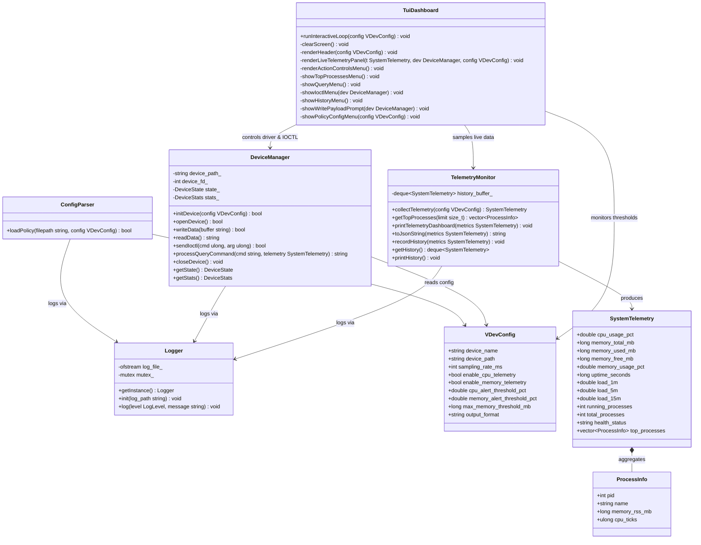
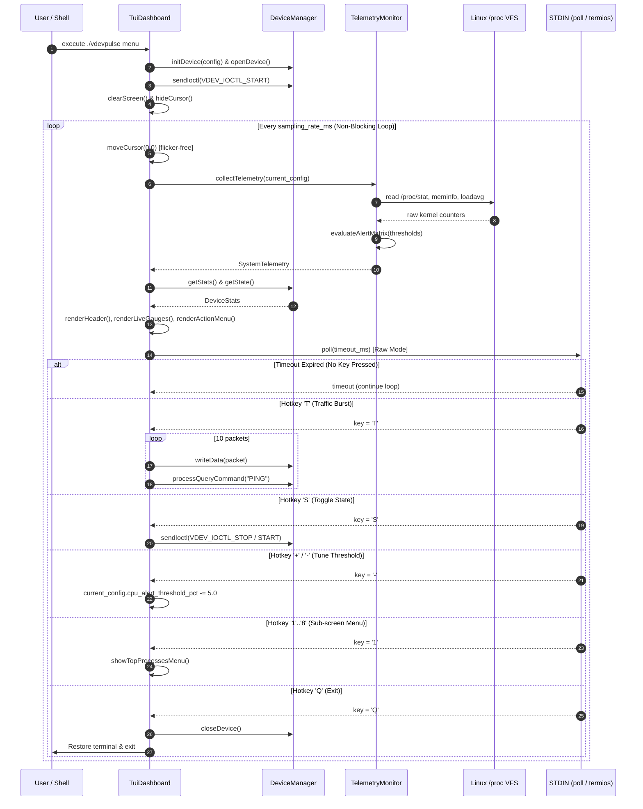
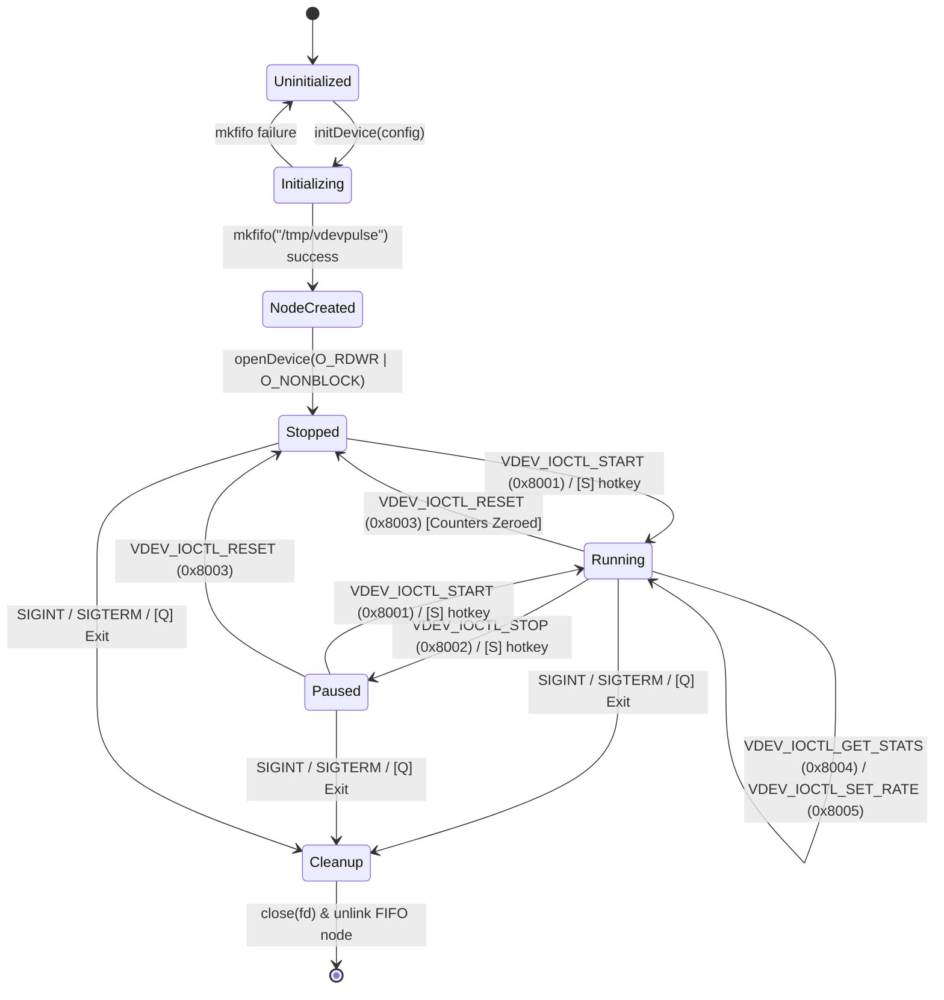
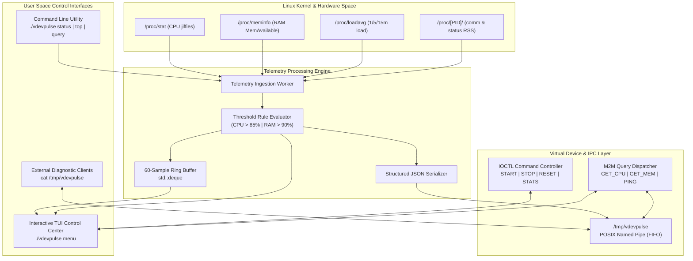

# Stage 3: System Design & Architecture

## 3.1 Overall System Architecture

VDevPulse is structured as a modular, single-process Linux systems software daemon with five loosely-coupled subsystems communicating through well-defined Modern C++17 interfaces.

```
╔═══════════════════════════════════════════════════════════════════════════════════════════════════╗
║                                vdevpulse — System Daemon Architecture                             ║
║                                                                                                   ║
║  ┌──────────────────┐    ┌───────────────────────────┐    ┌────────────────────┐                  ║
║  │   ConfigParser   │    │    Logger (Singleton)     │    │   History Buffer   │                  ║
║  │ vdev_policy.json │    │  INFO | SUCCESS | WARNING │    │  60-sample ring    │                  ║
║  │   (Thresholds)   │    │  ERROR | DEVICE           │    │    std::deque      │                  ║
║  └────────┬─────────┘    └─────────────┬─────────────┘    └─────────┬──────────┘                  ║
║           │ VDevConfig                 │ std::mutex RAII            │                             ║
║           ▼                            ▼                            ▼                             ║
║  ┌─────────────────────────────────────────────────────────────────────────────┐                  ║
║  │                               DeviceManager                                 │                  ║
║  │   * mkfifo() -> open(O_RDWR|O_NONBLOCK) -> write() -> read()                │                  ║
║  │   * processQueryCommand (GET_CPU, GET_MEM, GET_LOAD, GET_JSON, GET_HEALTH)  │                  ║
║  │   * IOCTL: START(0x8001), STOP(0x8002), RESET(0x8003), STATS(0x8004), RATE  │                  ║
║  │   * DeviceStats: total_bytes_written, total_reads, total_ioctls, queries    │                  ║
║  └─────────────────────────────────────┬───────────────────────────────────────┘                  ║
║                                        │ queries live metrics                                     ║
║                                        ▼                                                          ║
║  ┌─────────────────────────────────────────────────────────────────────────────┐                  ║
║  │                             TelemetryMonitor                                │                  ║
║  │   * /proc/stat    -> CPU tick delta -> cpu_usage_pct (%)                    │                  ║
║  │   * /proc/meminfo -> MemTotal, MemAvailable -> memory_used_mb (MB & %)      │                  ║
║  │   * /proc/loadavg -> 1m, 5m, 15m load averages & active/total threads       │                  ║
║  │   * /proc/uptime  -> System uptime (seconds)                                │                  ║
║  │   * /proc/[PID]/  -> Process memory RSS scanner & top resource consumers    │                  ║
║  │   * Threshold Rule Evaluator -> HEALTHY, WARNING_CPU, WARNING_MEM, CRITICAL │                  ║
║  │   * toJsonString() -> Structured JSON Serialization                         │                  ║
║  └─────────────────────────────────────┬───────────────────────────────────────┘                  ║
║                                        │                                                          ║
║           ┌────────────────────────────┴────────────────────────────┐                             ║
║           ▼                                                         ▼                             ║
║  ┌───────────────────────────────────────────┐    ┌───────────────────────────────────────────┐   ║
║  │        /tmp/vdevpulse (POSIX FIFO)        │    │    TuiDashboard (Non-Blocking TUI Engine) │   ║
║  │  Bidirectional IPC Character Stream Node  │    │  * POSIX poll() & raw termios event loop  │   ║
║  │  cat /tmp/vdevpulse | vdevpulse write MSG │    │  * Live Unicode gauges (██░░) & hotkeys   │   ║
║  │  Synchronous M2M Protocol Dispatcher      │    │  * Traffic bursts, IOCTL, alert tuning    │   ║
║  └───────────────────────────────────────────┘    └───────────────────────────────────────────┘   ║
╚═══════════════════════════════════════════════════════════════════════════════════════════════════╝
```

---

## 3.2 Major System Components & Responsibilities

| Component | Class / Struct | Responsibility |
| :--- | :--- | :--- |
| **Logger** | `Logger` (Singleton) | Thread-safe color-coded log output to stdout and file |
| **Policy Engine** | `ConfigParser`, `VDevConfig` | Load runtime settings, thresholds, and format from `vdev_policy.json` |
| **Telemetry Engine** | `TelemetryMonitor`, `SystemTelemetry`, `ProcessInfo` | Parse `/proc` kernel FS; compute CPU%, RAM%, loadavg, top processes; JSON serialization; history buffer |
| **Device Manager** | `DeviceManager`, `DeviceState`, `DeviceStats` | Create/open/read/write/close FIFO; process interactive query commands; handle IOCTL state & stats |
| **TUI Control Center** | `TuiDashboard` | Interactive Unicode/ANSI terminal control center with real-time non-blocking `poll()` loop & hotkey dispatch |
| **Daemon Entry Point** | `main()` | CLI dispatch (`menu`, `run`, `status`, `top`, `history`, `query`, `write`, `ioctl`), signal handling |

---

## 3.3 Core Data Structures

### 3.3.1 `VDevConfig` — Device Policy Configuration
```cpp
// include/vdevpulse/config.hpp
struct VDevConfig {
    std::string device_name                 = "vdevpulse";
    std::string device_path                 = "/tmp/vdevpulse";
    int         sampling_rate_ms            = 1000;
    bool        enable_cpu_telemetry        = true;
    bool        enable_memory_telemetry     = true;
    double      cpu_alert_threshold_pct     = 85.0;
    double      memory_alert_threshold_pct  = 90.0;
    long        max_memory_threshold_mb     = 4096;
    std::string output_format               = "text"; // "text" or "json"
};
```

### 3.3.2 `SystemTelemetry` & `ProcessInfo` — Live Telemetry Snapshot
```cpp
// include/vdevpulse/telemetry_monitor.hpp
struct ProcessInfo {
    int           pid           = 0;
    std::string   name          = "";
    long          memory_rss_mb = 0;
    unsigned long cpu_ticks     = 0;
};

struct SystemTelemetry {
    double                  cpu_usage_pct       = 0.0;
    long                    memory_total_mb     = 0;
    long                    memory_used_mb      = 0;
    long                    memory_free_mb      = 0;
    double                  memory_usage_pct    = 0.0;
    long                    uptime_seconds      = 0;
    double                  load_1m             = 0.0;
    double                  load_5m             = 0.0;
    double                  load_15m            = 0.0;
    int                     running_processes   = 0;
    int                     total_processes     = 0;
    std::string             health_status       = "HEALTHY";
    std::vector<ProcessInfo> top_processes;
};
```

### 3.3.3 `DeviceStats` & IOCTL Command Enums
```cpp
// include/vdevpulse/device_manager.hpp
enum class DeviceState { STOPPED, RUNNING, PAUSED };

constexpr unsigned long VDEV_IOCTL_START     = 0x8001;
constexpr unsigned long VDEV_IOCTL_STOP      = 0x8002;
constexpr unsigned long VDEV_IOCTL_RESET     = 0x8003;
constexpr unsigned long VDEV_IOCTL_GET_STATS = 0x8004;
constexpr unsigned long VDEV_IOCTL_SET_RATE  = 0x8005;

struct DeviceStats {
    uint64_t total_bytes_written = 0;
    uint64_t total_reads         = 0;
    uint64_t total_ioctls        = 0;
    uint64_t total_queries       = 0;
};
```

---

## 3.4 UML Diagrams

### 3.4.1 Comprehensive Class Diagram



---

### 3.4.2 Sequence Diagram — Interactive TUI Non-Blocking Event Loop



---

### 3.4.3 State Machine Diagram — Virtual Character Driver Lifecycle



---

### 3.4.4 Component Flow Diagram — Automated Alerting & Telemetry Pipeline



---

## 3.5 Version Control & Progress Evidence

- **SDLC Phase**: Stage 3 — System Design & Architecture
- **Git Commit**: `[Stage 3] System Architecture, UML diagrams & class interfaces`
- **Evidence**: Class declarations, UML diagrams, sequence diagrams, and data structures synchronized with code.
