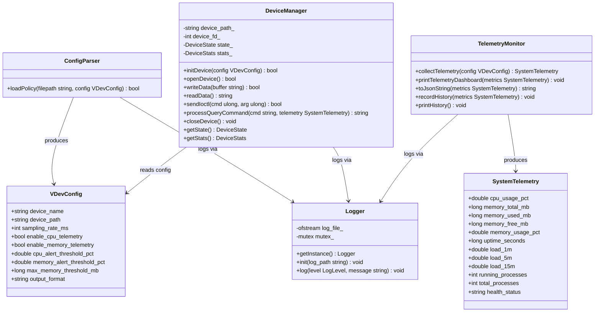
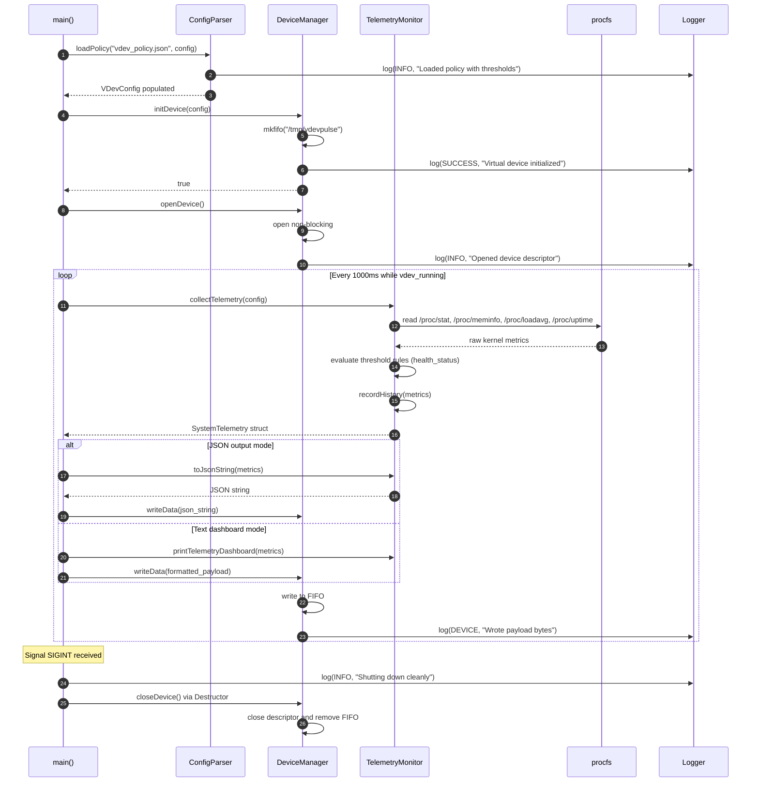
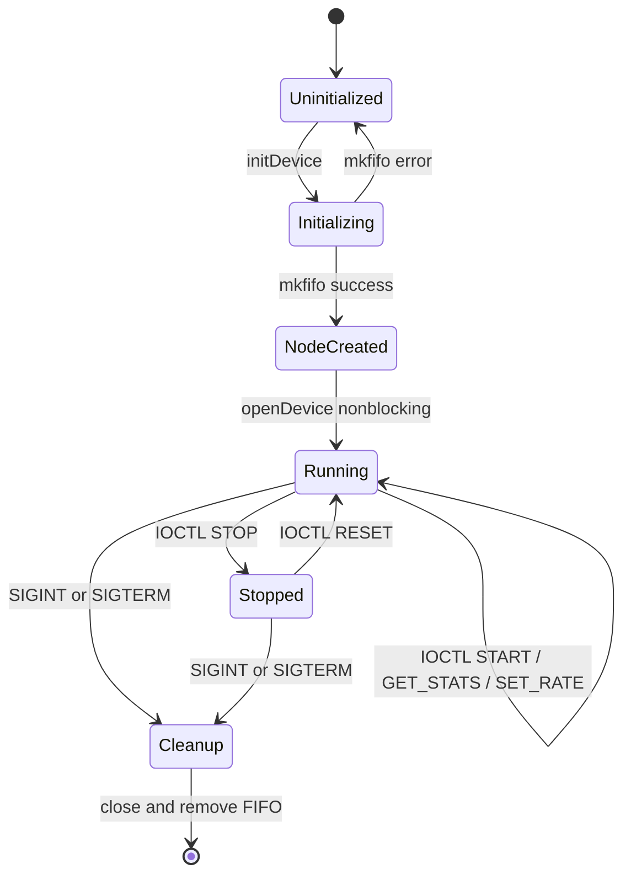

# Stage 3: System Design & Architecture

## 3.1 Overall System Architecture

VDevPulse is structured as a modular, single-process daemon with four loosely-coupled subsystems communicating through well-defined C++ interfaces.

```
╔═══════════════════════════════════════════════════════════════════════════════════╗
║                        vdevpulse — System Daemon                                  ║
║                                                                                   ║
║  ┌──────────────────┐    ┌───────────────────────────┐    ┌────────────────────┐  ║
║  │   ConfigParser   │    │    Logger (Singleton)     │    │   History Buffer   │  ║
║  │ vdev_policy.json │    │  INFO | SUCCESS | WARNING │    │  60-sample ring    │  ║
║  │   (Thresholds)   │    │  ERROR | DEVICE           │    │    std::deque      │  ║
║  └────────┬─────────┘    └─────────────┬─────────────┘    └─────────┬──────────┘  ║
║           │ VDevConfig                 │ std::mutex RAII            │             ║
║           ▼                            ▼                            ▼             ║
║  ┌─────────────────────────────────────────────────────────────────────────────┐  ║
║  │                               DeviceManager                                 │  ║
║  │   * mkfifo() -> open(O_RDWR|O_NONBLOCK) -> write() -> read()                │  ║
║  │   * processQueryCommand (GET_CPU, GET_MEM, GET_LOAD, GET_JSON, GET_HEALTH)  │  ║
║  │   * IOCTL: START(0x8001), STOP(0x8002), RESET(0x8003), STATS(0x8004), RATE  │  ║
║  │   * DeviceStats: total_bytes_written, total_reads, total_ioctls, queries    │  ║
║  └─────────────────────────────────────┬───────────────────────────────────────┘  ║
║                                        │ queries live metrics                     ║
║                                        ▼                                          ║
║  ┌─────────────────────────────────────────────────────────────────────────────┐  ║
║  │                             TelemetryMonitor                                │  ║
║  │   * /proc/stat    -> CPU tick delta -> cpu_usage_pct (%)                    │  ║
║  │   * /proc/meminfo -> MemTotal, MemAvailable -> memory_used_mb (MB & %)      │  ║
║  │   * /proc/loadavg -> 1m, 5m, 15m load averages & active/total threads       │  ║
║  │   * /proc/uptime  -> System uptime (seconds)                                │  ║
║  │   * Threshold Rule Evaluator -> HEALTHY, WARNING_CPU, WARNING_MEM           │  ║
║  │   * toJsonString() -> Structured JSON Serialization                         │  ║
║  └─────────────────────────────────────┬───────────────────────────────────────┘  ║
║                                        │ writes stream/JSON                       ║
║                                        ▼                                          ║
║                             /tmp/vdevpulse (POSIX FIFO)                           ║
╚════════════════════════════════════════│══════════════════════════════════════════╝
                                         │ POSIX read() / write()
                                         ▼
                            User-Space Shell & Applications
                            (cat /tmp/vdevpulse, vdevpulse query CMD)
```

---

## 3.2 Major System Components & Responsibilities

| Component | Class / Struct | Responsibility |
| :--- | :--- | :--- |
| **Logger** | `Logger` (Singleton) | Thread-safe color-coded log output to stdout and file |
| **Policy Engine** | `ConfigParser`, `VDevConfig` | Load runtime settings, thresholds, and format from `vdev_policy.json` |
| **Telemetry Engine** | `TelemetryMonitor`, `SystemTelemetry` | Parse `/proc` kernel FS; compute CPU%, RAM%, loadavg, health status; JSON serialization; history buffer |
| **Device Manager** | `DeviceManager`, `DeviceState`, `DeviceStats` | Create/open/read/write/close FIFO; process interactive query commands; handle IOCTL state & stats |
| **TUI Dashboard** | `TuiDashboard` | Interactive Unicode/ANSI terminal control center with real-time non-blocking loop & hotkey dispatch |
| **Daemon Entry Point** | `main()` | CLI dispatch (`menu`, `run`, `status`, `history`, `query`, `write`, `ioctl`), signal handling |

---

## 3.3 Core Data Structures

### 3.3.1 `VDevConfig` — Device Policy Configuration
```cpp
// include/vdevpulse/config.hpp
struct VDevConfig {
    std::string device_name                 = "vdevpulse";
    std::string device_path                 = "/tmp/vdevpulse";
    int         sampling_rate_ms            = 1000;
    bool        enable_cpu_telemetry        = true;
    bool        enable_memory_telemetry     = true;
    double      cpu_alert_threshold_pct     = 85.0;
    double      memory_alert_threshold_pct  = 90.0;
    long        max_memory_threshold_mb     = 4096;
    std::string output_format               = "text"; // "text" or "json"
};
```

### 3.3.2 `SystemTelemetry` — Live Telemetry Snapshot
```cpp
// include/vdevpulse/telemetry_monitor.hpp
struct SystemTelemetry {
    double      cpu_usage_pct       = 0.0;
    long        memory_total_mb     = 0;
    long        memory_used_mb      = 0;
    long        memory_free_mb      = 0;
    double      memory_usage_pct    = 0.0;
    long        uptime_seconds      = 0;
    double      load_1m             = 0.0;
    double      load_5m             = 0.0;
    double      load_15m            = 0.0;
    int         running_processes   = 0;
    int         total_processes     = 0;
    std::string health_status       = "HEALTHY";
};
```

### 3.3.3 `DeviceStats` & IOCTL Command Enums
```cpp
// include/vdevpulse/device_manager.hpp
enum class DeviceState { STOPPED, RUNNING, PAUSED };

constexpr unsigned long VDEV_IOCTL_START     = 0x8001;
constexpr unsigned long VDEV_IOCTL_STOP      = 0x8002;
constexpr unsigned long VDEV_IOCTL_RESET     = 0x8003;
constexpr unsigned long VDEV_IOCTL_GET_STATS = 0x8004;
constexpr unsigned long VDEV_IOCTL_SET_RATE  = 0x8005;

struct DeviceStats {
    uint64_t total_bytes_written = 0;
    uint64_t total_reads         = 0;
    uint64_t total_ioctls        = 0;
    uint64_t total_queries       = 0;
};
```

---

## 3.4 UML Diagrams

### 3.4.1 Class Diagram



### 3.4.2 Sequence Diagram — Telemetry Sampling, Threshold Check & Device I/O



### 3.4.3 State Machine Diagram — Virtual Device Lifecycle & IOCTLs



---

## 3.5 Version Control & Progress Evidence

- **SDLC Phase**: Stage 3 — System Design & Architecture
- **Git Commit**: `[Stage 3] System Architecture, UML diagrams & class interfaces`
- **Evidence**: Class declarations, UML diagrams, and data structures synchronized with code.
