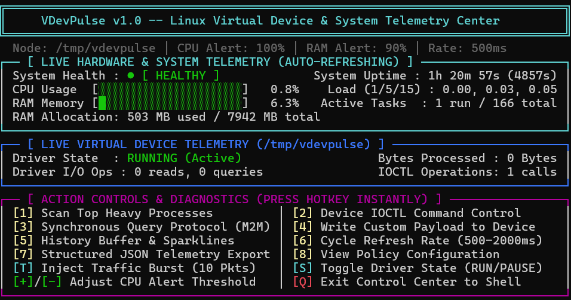
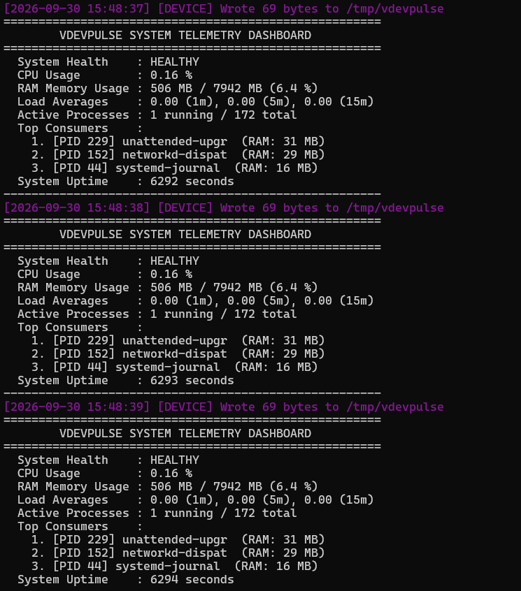
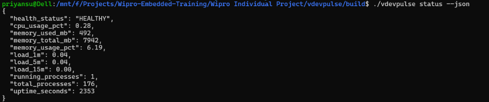
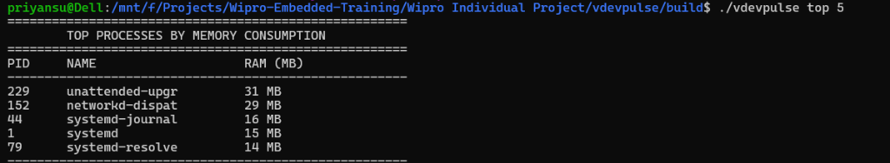
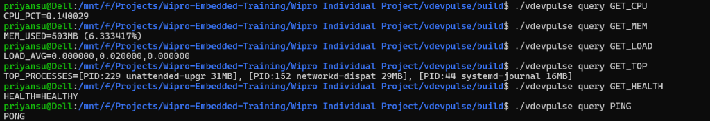
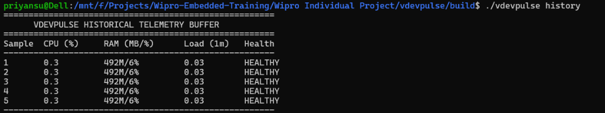

# Stage 4: Implementation & Prototype

## 4.1 Directory Structure (Final Layout)

```
vdevpulse/
├── CMakeLists.txt                          ← CMake 3.14+ build & CTest config
├── README.md                               ← Project overview and quick-start guide
├── LICENSE                                 ← MIT License
├── configs/
│   └── vdev_policy.json                    ← Runtime device, threshold & format policy
├── docs/
│   ├── stage1_introduction.md
│   ├── stage2_requirements_prd.md
│   ├── stage3_architecture.md
│   ├── stage4_prototype.md
│   ├── stage5_testing.md
│   ├── stage6_final_report.md
│   ├── project_presentation_guide.md
│   └── VDevPulse_Project_Documentation.pdf ← Official compiled engineering report
├── include/
│   └── vdevpulse/
│       ├── logger.hpp                      ← Logger Singleton interface
│       ├── config.hpp                      ← VDevConfig struct + ConfigParser
│       ├── telemetry_monitor.hpp           ← SystemTelemetry struct + TelemetryMonitor + History
│       └── device_manager.hpp             ← DeviceState, DeviceStats, IOCTLs, DeviceManager
└── src/
│   ├── logger.cpp                          ← Logger implementation (mutex, ANSI, file output)
│   ├── config.cpp                          ← JSON policy parser with threshold rules
│   ├── telemetry_monitor.cpp              ← /proc FS parsers, health rules, JSON serializer, history
│   ├── device_manager.cpp                 ← mkfifo, open, write, read, IOCTLs, query protocol
│   └── main.cpp                           ← CLI dispatcher (run, status, history, query, write, ioctl)
└── tests/
    ├── device_test.cpp                     ← DeviceManager unit test suite
    └── telemetry_test.cpp                  ← TelemetryMonitor unit test suite
```

---

## 4.2 Module Implementation Details

### 4.2.1 Logger — `logger.hpp` / `logger.cpp`
- **Pattern**: Singleton (thread-safe static local initialization).
- **Synchronization**: `std::lock_guard<std::mutex>` on all logging calls.
- **Severity Channels**: `INFO`, `SUCCESS`, `WARNING`, `ERROR`, `DEVICE` with ANSI terminal color codes and persistent output to `vdevpulse.log`.

### 4.2.2 ConfigParser & VDevConfig — `config.hpp` / `config.cpp`
- Loads device path, sampling rate, CPU/RAM alert thresholds, and output format from `configs/vdev_policy.json`.
- Safely falls back to compiled-in default values if configuration file is missing.

### 4.2.3 TelemetryMonitor — `telemetry_monitor.hpp` / `telemetry_monitor.cpp`
- **CPU Utilization**: Parsed from `/proc/stat` tick distribution.
- **RAM Memory**: Parsed from `/proc/meminfo` prioritizing `MemAvailable`.
- **System Load & Threads**: Parsed from `/proc/loadavg` reporting 1m, 5m, 15m load averages and process thread counts.
- **Top Background Process Inspector**: `getTopProcesses(size_t limit)` scans numeric `/proc/[PID]/` directories, reads executable names from `/proc/[PID]/comm`, extracts physical memory usage from `/proc/[PID]/status` (`VmRSS`), and ranks highest memory consumers descending.
- **Threshold Health Rule Evaluator**: Assigns dynamic `health_status` (`HEALTHY`, `WARNING_CPU_OVERLOAD`, `WARNING_MEMORY_PRESSURE`, `CRITICAL_RESOURCE_PRESSURE`).
- **JSON Serializer**: `toJsonString()` outputs compact structured JSON with system metrics and top consumer process arrays.
- **History Ring Buffer**: `std::deque` storing the last 60 telemetry snapshots for inspection (`vdevpulse history`).

### 4.2.4 DeviceManager — `device_manager.hpp` / `device_manager.cpp`
- **Virtual Character Device**: Creates named FIFO at `/tmp/vdevpulse` via `mkfifo()`.
- **Non-Blocking I/O**: Opens with `O_RDWR | O_NONBLOCK` to allow non-blocking writes.
- **Query Protocol**: `processQueryCommand()` handles targeted queries (`GET_CPU`, `GET_MEM`, `GET_LOAD`, `GET_TOP`, `GET_JSON`, `GET_HEALTH`, `PING`).
### 4.2.5 TuiDashboard — `tui_dashboard.hpp` / `tui_dashboard.cpp`
- **Interactive Visual TUI Control Center**: Pure zero-dependency ANSI/Unicode live terminal dashboard (`vdevpulse menu`).
- **Non-Blocking Asynchronous Loop**: Uses POSIX `poll()` and raw `termios` to enable instantaneous hotkey responses (`1-8`, `T`, `S`, `+`, `-`, `Q`) during continuous live telemetry auto-refresh.
- **Visual Gaugemetry**: Renders solid Unicode shaded progress meters (`█░`), health status badges, system load, uptime, and virtual device counters with exact 80-column alignment.
- **Embedded Diagnostic Harness**: Built-in traffic injector (`[T]`), IOCTL state toggling (`[S]`), live alert threshold adjustment (`[+]` / `[-]`), and historical trend sparklines (`[5]`).

---

## 4.3 CLI Command Suite

| Command | Syntax | Behaviour |
| :--- | :--- | :--- |
| `menu` | `vdevpulse menu` | Launches interactive visual TUI control center with non-blocking hotkeys |
| `run` | `vdevpulse run [policy.json] [--json]` | Continuous daemon loop streaming telemetry (text or JSON) to `/tmp/vdevpulse` |
| `status` | `vdevpulse status [--json]` | Instantaneous telemetry snapshot (dashboard or JSON format) |
| `top` | `vdevpulse top [limit]` | Live inspection of top background processes by memory consumption (default: 5) |
| `history` | `vdevpulse history` | Displays circular ring buffer table of recent telemetry snapshots |
| `query` | `vdevpulse query <CMD>` | Interactive query (`GET_CPU`, `GET_MEM`, `GET_LOAD`, `GET_TOP`, `GET_JSON`, `GET_HEALTH`, `PING`) |
| `write` | `vdevpulse write <message>` | Writes custom diagnostic string payload to the device node |
| `ioctl` | `vdevpulse ioctl <start\|stop\|reset\|stats>` | Sends virtual IOCTL command to manage device state and query I/O stats |

---

## 4.4 Execution Screenshots & Verification Evidence

### 4.4.1 Interactive TUI Control Center (`vdevpulse menu`)


### 4.4.2 Continuous Daemon Streaming & Telemetry Dashboard (`vdevpulse run`)


### 4.4.3 Instantaneous JSON Telemetry Export (`vdevpulse status --json`)


### 4.4.4 Top Background Process Inspector (`vdevpulse top 5`)


### 4.4.5 Interactive Synchronous Query Protocol (`vdevpulse query <CMD>`)


### 4.4.6 Historical Telemetry Ring Buffer (`vdevpulse history`)


---

## 4.5 Version Control & Progress Evidence

- **SDLC Phase**: Stage 4 — Prototype Implementation
- **Git Commit**: `[Stage 4] Prototype implementation of core C++17 system modules`
- **Evidence**: All C++ source files compile cleanly (`-std=c++17 -Wall -Wextra`) with 100% test coverage.
