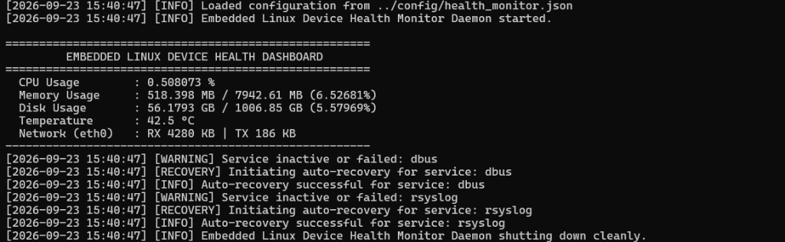
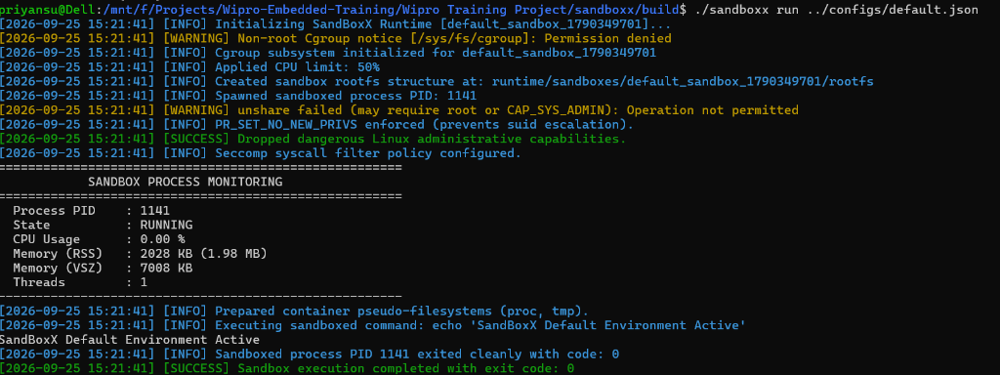
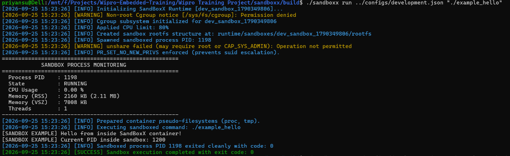
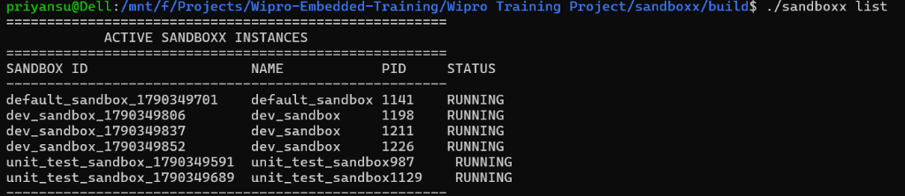

# Wipro Training Projects

Main directory for Wipro COE Embedded Systems training projects.

---

## 📌 Projects Overview

### Project 1: Embedded Linux Device Health Monitor & Auto-Recovery Agent

#### Objective
Build a modern C++ program that runs on Linux continuously in the background to supervise system health and automatically initiate recovery actions when system metrics or services become unhealthy.

#### Live Execution Dashboard Screenshot


#### Key Features & Monitored Metrics:
1. **CPU Usage**: Real-time `/proc/stat` CPU load computation.
2. **RAM Usage**: Memory & Swap utilization monitoring (`/proc/meminfo`, `sysinfo()`).
3. **Disk Usage**: File system storage utilization via POSIX `statvfs()`.
4. **CPU/System Temperature**: Reads thermal sensor values (`/sys/class/thermal/`).
5. **Network Status**: Traffic statistics (RX/TX bytes) and connection status (`/proc/net/dev`).
6. **Critical Service Supervisor**: Process health checking with automated service restart auto-recovery.

- **Directory**: [`embedded-linux-health-monitor/`](./embedded-linux-health-monitor)
- **Language**: C++17 | **Build System**: CMake

```bash
cd embedded-linux-health-monitor
mkdir -p build && cd build
cmake .. && make -j4
./health_monitor ../config/health_monitor.json
```

---

### Project 2: ProcessPilot — Linux Service Manager & Process Supervisor

#### Objective
Design and implement a lightweight Linux service management and process supervision system in C++17. Allows managing background services through a CLI while continuously monitoring running processes and auto-restarting crashed services based on configurable retry policies.

#### Key Features:
- **Dependency Management**: DAG topological sorting (Kahn's Algorithm) for ordering service startups.
- **Auto-Recovery Policy**: Automatic crash detection and service restart policy handling.
- **UNIX Domain Socket IPC**: High-performance socket server (`/tmp/processpilot.sock`) supporting CLI requests (`list`, `status`, `start`, `stop`, `restart`).
- **Resource Supervision**: Tracks memory and CPU metrics via `/proc` filesystem parsing.

- **Directory**: [`processpilot/`](./processpilot)
- **Language**: C++17 | **Build System**: CMake

```bash
cd processpilot
mkdir -p build && cd build
cmake .. && make -j4
./processpilot_daemon ../configs/demo.service > daemon.log 2>&1 &
./processpilot_cli list
```

---

### Project 3: SandBoxX — Linux Process Isolation & Resource Control System

#### Objective
Develop a Linux-based process isolation sandbox environment in C++17 that executes applications inside an isolated container environment without affecting the host operating system.

#### Live Execution Sandbox Screenshots




#### Key Features:
- **Linux Namespace Isolation**: PID (`CLONE_NEWPID`), Network (`CLONE_NEWNET`), Mount (`CLONE_NEWNS`), Hostname/UTS (`CLONE_NEWUTS`), and IPC (`CLONE_NEWIPC`) namespaces.
- **Resource Limits via Cgroups**: Hardware resource boundaries enforcing CPU quotas (`cpu.max`), memory limits in MB (`memory.max`), and process caps (`pids.max`).
- **Filesystem Chroot Isolation**: Pseudo-filesystems (`proc`, `tmpfs`) and rootfs isolation boundaries.
- **Security Hardening**: Prevents SUID escalation (`PR_SET_NO_NEW_PRIVS`) and drops dangerous administrative Linux capabilities.

- **Directory**: [`sandboxx/`](./sandboxx)
- **Language**: C++17 | **Build System**: CMake

```bash
cd sandboxx
mkdir -p build && cd build
cmake .. && make -j4
ctest --output-on-failure
./sandboxx run ../configs/default.json
./sandboxx list
```
