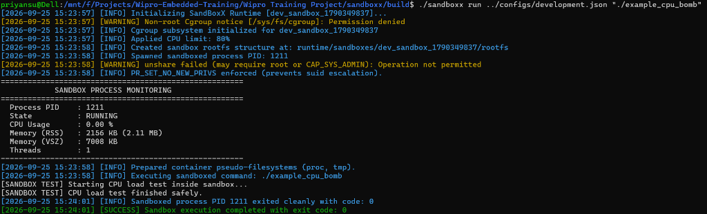
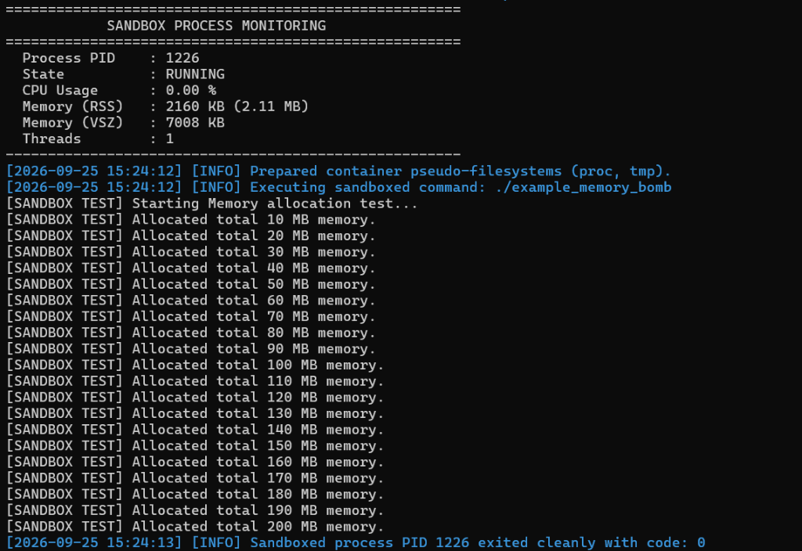

# SandBoxX — Linux Process Isolation & Resource Control System

SandBoxX is a lightweight Linux process isolation and container runtime engine built in modern C++17. It allows executing untrusted or resource-heavy applications in a secure, isolated sandbox environment without altering the host operating system.

## Key Features

- **Linux Namespace Isolation**: Complete separation using PID (`CLONE_NEWPID`), Network (`CLONE_NEWNET`), Mount (`CLONE_NEWNS`), Hostname/UTS (`CLONE_NEWUTS`), and IPC (`CLONE_NEWIPC`) namespaces.
- **Resource Control via Cgroups**: Hardware resource boundaries enforcing CPU quota percentages (`cpu.max`), memory limits in MB (`memory.max`), and process count caps (`pids.max`).
- **Filesystem Chroot Isolation**: Isolated container filesystem layout with pseudo-filesystems (`proc`, `tmpfs`) and rootfs boundary protection.
- **Security Policy Enforcement**: Capability dropping (`PR_CAPBSET_DROP`), no-new-privileges flag (`PR_SET_NO_NEW_PRIVS`), and system call filtering.
- **CLI Management Suite**: Command-line interface for starting, inspecting, monitoring, and terminating sandboxed processes.

---

## Directory Structure

```text
sandboxx/
├── CMakeLists.txt
├── README.md
├── LICENSE
├── include/sandboxx/
│   ├── sandbox_config.hpp
│   ├── runtime.hpp
│   ├── process_manager.hpp
│   ├── namespace_manager.hpp
│   ├── cgroup_manager.hpp
│   ├── filesystem_manager.hpp
│   ├── security_manager.hpp
│   ├── monitor.hpp
│   ├── logger.hpp
│   └── utils.hpp
├── src/
│   ├── main.cpp
│   ├── cli/
│   ├── runtime/
│   ├── process/
│   ├── namespace/
│   ├── cgroup/
│   ├── filesystem/
│   ├── security/
│   ├── monitor/
│   └── common/
├── configs/
│   ├── default.json
│   ├── restricted.json
│   └── development.json
├── rootfs/
├── examples/
├── tests/
├── runtime/
├── scripts/
└── docs/
```

---

## Building and Running

### Prerequisites
- GCC / G++ (C++17 support)
- CMake >= 3.14
- Linux Kernel with namespace and cgroups enabled

### Build Steps

```bash
mkdir -p build && cd build
cmake ..
make -j$(nproc)
ctest --output-on-failure
```

---

## Usage Examples

### 1. Run a Sandboxed Process
```bash
./sandboxx run ../configs/default.json "echo 'Hello from SandBoxX'"
```

### 2. Run Example CPU & Memory Tests
```bash
./sandboxx run ../configs/restricted.json "./example_cpu_bomb"
./sandboxx run ../configs/restricted.json "./example_memory_bomb"
```

### 3. List Active Sandboxes
```bash
./sandboxx list
```

### 4. Inspect Sandbox Details
```bash
./sandboxx inspect <sandbox_id>
```

### 5. Stop a Sandbox
```bash
./sandboxx stop <sandbox_id>
```

---

## Screenshots & Execution Demo

### Default Sandbox Execution


### Custom Program Execution & PID Namespace Isolation


### Resource Load Monitoring (CPU & Memory)



### Active Sandboxes List CLI


