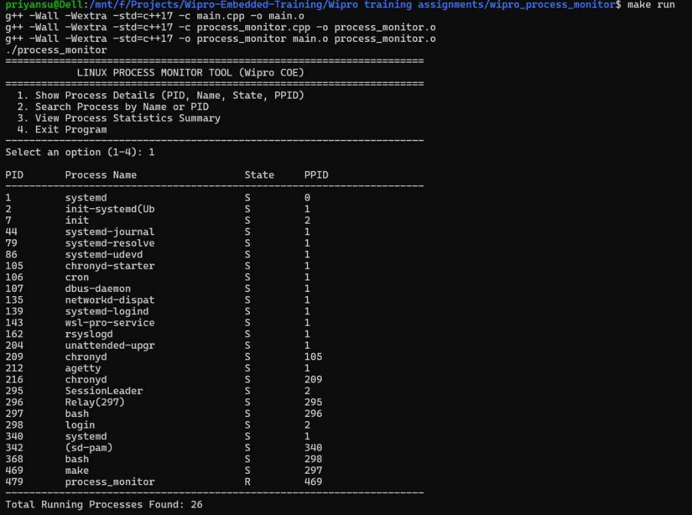
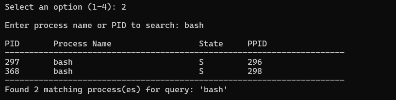
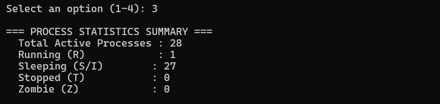

# Linux Process Monitor (C++)

C++ program utilizing `<filesystem>`, `<iostream>`, and `<vector>` to list running processes from `/proc`, displaying PID, process name, state, and parent PID.

---

## 📊 Program Execution Screenshots

### 1. Show Process Details (Option 1)


### 2. Search Process by Name or PID (Option 2)


### 3. View Process Statistics Summary (Option 3)


---

## Files
- `main.cpp` - Interactive menu and CLI
- `process_monitor.cpp` - `/proc` directory reader and status parser
- `process_monitor.hpp` - Header file
- `Makefile` - Build file (`g++ -std=c++17`)

## Compilation and Execution
```bash
make
./process_monitor
```
