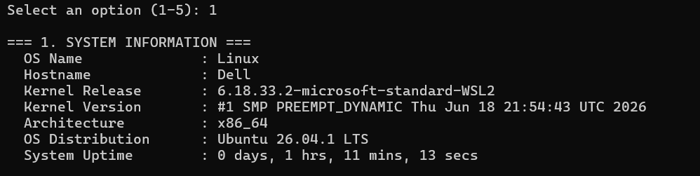
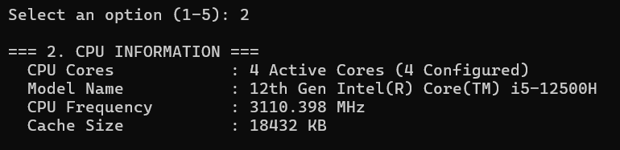

# Linux System Information Tool (C++)

C++ program that fetches Linux system information, CPU details, and memory usage using POSIX system calls (`uname`, `sysinfo`) and `/proc` files.

---

## 📊 Program Execution Screenshots

### Full System Summary (Option 4)


### 1. System Information (Option 1)


### 2. CPU Information (Option 2)


### 3. Memory Information (Option 3)


---

## Files
- `main.cpp` - Entry point and user menu
- `sys_info.cpp` - System info parsing implementation
- `sys_info.hpp` - Header file
- `Makefile` - Build instructions (`g++ -std=c++17`)

## Compilation and Execution
```bash
make
./sysinfo_tool
```
