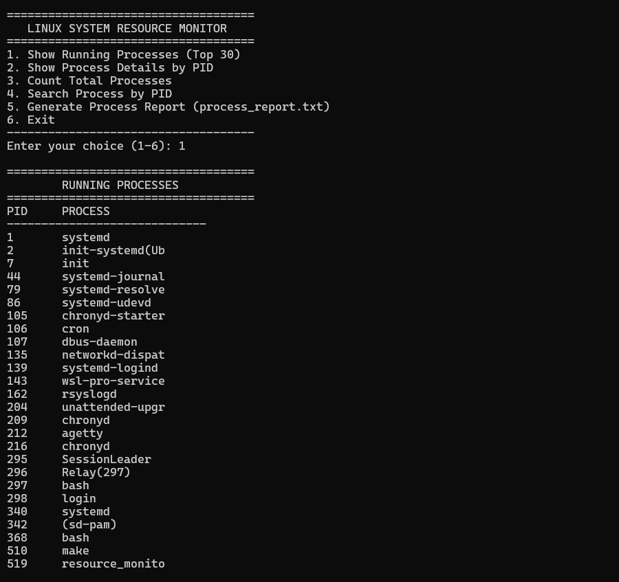
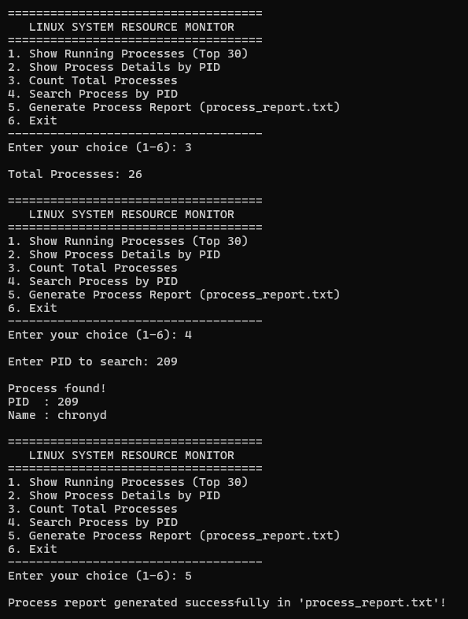

# Linux System Resource Monitor (C++)

C++ program using `<filesystem>` and `<fstream>` to monitor processes, display PID status details, search processes, and generate a report to `process_report.txt`.

---

## 📊 Program Execution Screenshots

### 1. Show Running Processes (Option 1)


### 2. Show Process Details by PID (Option 2)


### 3. Count, Search & Generate Report (Options 3, 4 & 5)


---

## Files
- `main.cpp` - C++ source file
- `Makefile` - Build file (`g++ -std=c++17`)

## Compilation and Execution
```bash
make
./resource_monitor
```
